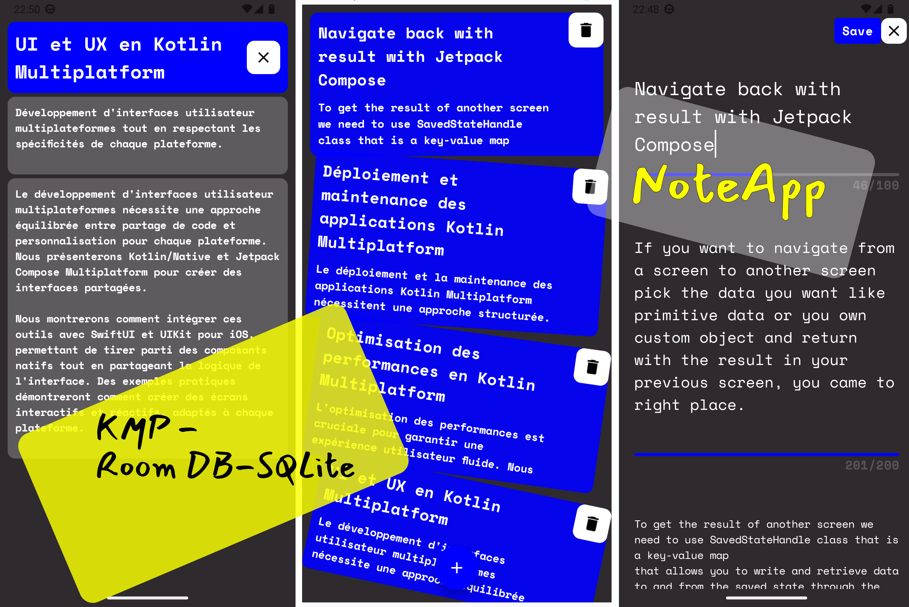

[AppCover](KMP_NoteApp_Cover.png)

# Android Notes Application with Kotlin Multiplatform

**This is a Notes application developed using Kotlin Multiplatform (KMP). Currently, the project supports only the Android platform. The app demonstrates the use of shared code to handle business logic, using RoomDB for local storage, Navigation for routing, and Voyager for dependency injection, following a Clean Architecture and MVVM pattern.**

## Features
- Add, read and delete notes
- Notes stored locally using RoomDB and SQLite
- Navigation handled via Navigation library
- Dependency injection with Voyager
- Clean Architecture and MVVM pattern

## Technologies Used
- **Kotlin Multiplatform (KMP)**
- **RoomDB and SQLite** for local storage
- **Navigation** for routing
- **Voyager** for dependency injection
- **Clean Architecture** for project structure
- **MVVM (Model-View-ViewModel)** for architecture pattern

## Project Structure
- **commonMain**: Shared code (logic, models, etc.)
- **androidMain**: Android-specific code

## Getting Started
### Prerequisites
- Android Studio and Fleet
- Kotlin 2.0.0

### Resources
**Clone the repository** : https://github.com/BaHithBENON/NoteApp-RoomDB-KMP.git

## Design Inspiration
- [SwiftUI App Demo in LinkedIn](https://www.linkedin.com/posts/ganeshrajugalla_swiftui-iosdevelopment-visualeffects-activity-7215222641689812993-LlKT?utm_source=share&utm_medium=member_desktop)
- [Medium](https://medium.com/@ganeshrajugalla/swiftui-using-visualeffect-for-hue-and-rotation-c57c8596e892)

## Acknowledgments
- JetBrains for Kotlin Multiplatform
- The Android development community

***********

This is a Kotlin Multiplatform project targeting Android, iOS, Desktop.

* `/composeApp` is for code that will be shared across your Compose Multiplatform applications.
  It contains several subfolders:
  - `commonMain` is for code that’s common for all targets.
  - Other folders are for Kotlin code that will be compiled for only the platform indicated in the folder name.
    For example, if you want to use Apple’s CoreCrypto for the iOS part of your Kotlin app,
    `iosMain` would be the right folder for such calls.

* `/iosApp` contains iOS applications. Even if you’re sharing your UI with Compose Multiplatform, 
  you need this entry point for your iOS app. This is also where you should add SwiftUI code for your project.

Learn more about [Kotlin Multiplatform](https://www.jetbrains.com/help/kotlin-multiplatform-dev/get-started.html)…
